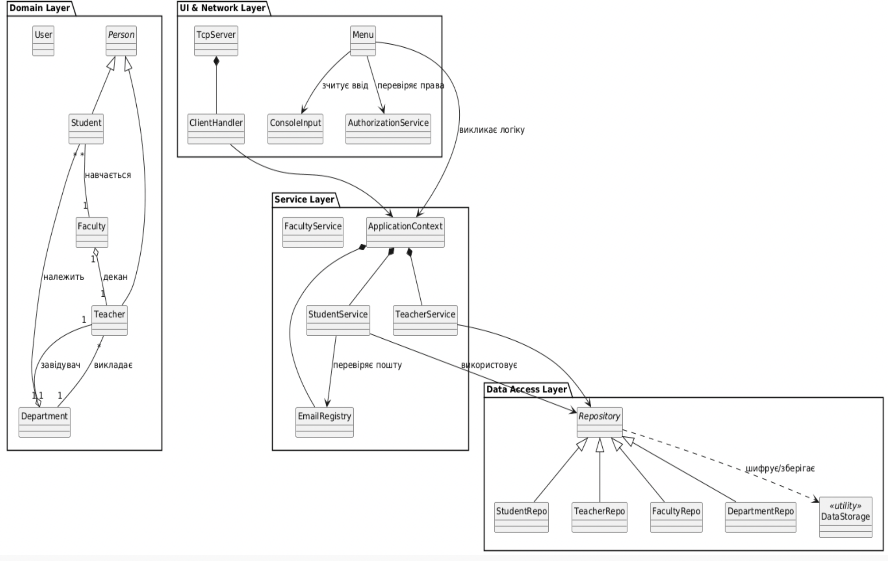

# Навчальний проект “DigiUni”

МІНІСТЕРСТВО ОСВІТИ І НАУКИ УКРАЇНИ
Національний університет “Києво-Могилянська академія”
Факультет інформатики

**З дисципліни:** “Алгоритми та структури даних”
**Тема:** Система обліку студентів і викладачів НаУКМА

**Виконали студенти 1 курсу спеціальності 121 "Інженерія програмного забезпечення":**

* Грох Арсеній Миколайович (група 1)
* П’ятаченко Гліб Олександрович (група \#)

**Викладач:** Кирієнко Оксана Валентинівна  
*м. Київ – 2025*

-----

## Постановка задачі

* **Основна мета:** Створити консольну інформаційну систему університету, яка покриває всі теми курсу Advanced Java: ООП, колекції, дженеріки, винятки, логування, функціональне програмування, Stream API, сучасні типи Java, I/O, багатопоточність, мережу, рефлексію та анотації, тестування і роботу з Git.
* **Предметна область:** Потрібно реалізувати систему обліку факультетів, кафедр, студентів і викладачів університету НаУКМА. Система працює у консольному режимі, спілкується з користувачем через меню і зберігає дані в структурованому вигляді.

### Дані сутностей:

* **Університет:** повна назва, скорочена назва, місто, адреса.
* **Факультет:** унікальний код, назва, скорочена назва, декан (посилання на викладача), контакти.
* **Кафедра:** унікальний код, назва, факультет (посилання), завідувач (посилання на викладача), кабінет/локація.
* **Персона (базовий тип):** унікальний ідентифікатор, ПІБ (3 частини), дата народження, email, телефон.
* **Студент:** ідентифікатор студента/залікова, курс (1-6), група, рік вступу, форма навчання (бюджет/контракт), статус (навчається/академвідпустка/відрахований).
* **Викладач:** посада, науковий ступінь, вчене звання, дата прийняття на роботу, ставка/навантаження.

### Операції керування даними:

* Створити/видалити/редагувати факультет.
* Створити/видалити/редагувати кафедру факультету.
* Додати/видалити/редагувати студента/викладача в кафедрі.
* Переводити студента між групами/кафедрами та змінювати курс.

### Пошук і звіти:

* Знайти студента/викладача за ПІБ, курсом або групою.
* Вивести всіх студентів, впорядкованих за курсами.
* Вивести всіх студентів/викладачів факультету, впорядкованих за алфавітом.
* Вивести всіх студентів кафедри, впорядкованих за курсами.
* Вивести всіх студентів/викладачів кафедри, впорядкованих за алфавітом.
* Вивести всіх студентів кафедри вказаного курсу (звичайний список та впорядкований за алфавітом).

### Доступ і ролі:

Потрібна авторизація (логін/пароль) і розмежування прав доступу:

* **Користувач (USER):** лише перегляд (пошук і звіти).
* **Менеджер (MANAGER):** повний доступ до CRUD, без керування користувачами.
* **Адміністратор (ADMIN):** повний доступ + створення/редагування/блокування користувачів і ролей.

-----

## Розподіл ролей

* **Грох Арсеній:** відповідальний за структуру та підтримку гіт-репозиторію, створення всіх моделей (`Student`, `Person`, `University`, `Teacher`, `Faculty`, `Department`), CRUD, Service Layer (ApplicationContext, розбиття бізнес-логіки на сервіси), зберігання даних та їх шифрування, валідацію паролів та емейлів (забезпечення унікальності емейлів), авторизацію.
* **П’ятаченко Гліб:** відповідальний за структуру проєкту, винятки та логування, анотації та їхню валідацію, валідацію консольних вводів, модель TCP-server/client, охайний вивід даних в консоль, рефакторинг та покращення коду.
* **Спільна робота:** документація, звіт, сортування та пошук, тести.

-----

## Опис можливостей

### 1\. Управління структурою університету (CRUD операції)

Система забезпечує повний цикл керування даними для основних сутностей: Факультети, Кафедри, Викладачі та Студенти.

* **Створення та реєстрація:** Додавання нових записів із автоматичною генерацією унікальних ідентифікаторів (ID).
* **Редагування:** Можливість зміни будь-якого поля існуючого об'єкта (ПІБ, контакти, посади, курси) з миттєвим оновленням у базі.
* **Видалення:** Безпечне видалення записів із автоматичним вивільненням пов'язаних ресурсів (наприклад, емейлів).
* **Зв'язки між сутностями:** Логічна прив'язка студентів до кафедр, викладачів до посад деканів чи завідувачів кафедр.

### 2\. Багаторівнева система авторизації

Доступ до функцій системи розмежовано згідно з ролями користувачів:

* **Administrator:** Повний доступ до всіх реєстрів, а також керування обліковими записами користувачів (реєстрація, редагування, блокування/розблокування).
* **Manager:** Право на модифікацію даних (додавання, редагування, видалення) студентів та викладачів.
* **User (Гість):** Режим "тільки для читання" — перегляд списків, пошук та генерація звітів без можливості внесення змін.

### 3\. Пошук та аналітична звітність (Stream API)

Система надає потужні інструменти для роботи з даними в реальному часі:

* **Гнучкий пошук:** Знаходження студентів чи викладачів за ID, частиною імені, кодом курсу або роком навчання.
* **Сортування:** Вивід списків у алфавітному порядку або за специфічними критеріями (наприклад, за роком вступу).
* **Генерація статистичних звітів:**
  * Розподіл студентів за формами навчання (денна, заочна, академвідпустка).
  * Кількісний аналіз студентів на кожному факультеті.
  * Розрахунок фінансових показників (наприклад, середня ставка викладачів).

### 4\. Мережева архітектура та багатопоточність (TCP)

Завдяки переходу на клієнт-серверну модель, система підтримує:

* **Віддалений доступ:** Можливість підключення клієнта до центрального сервера через мережу TCP/IP.
* **Паралельна робота:** Сервер реалізовано з використанням багатопоточності, що дозволяє декільком користувачам працювати з реєстрами одночасно без блокування системи.

### 5\. Безпека та цілісність даних

* **Валідація даних:** Використання кастомних анотацій та Reflection API для перевірки коректності вводу (наприклад, довжина імені, формат email чи складність пароля).
* **Захист від некоректного вводу:** Реалізовано буферний захист консольного вводу, що запобігає крашу програми при введенні букв замість цифр.
* **Шифрування даних:** Вся база даних зберігається у бінарних файлах із застосуванням **XOR-шифрування**, що запобігає несанкціонованому читанню файлів безпосередньо з диска.
* **Унікальність ідентифікаторів:** Реалізовано механізм перевірки унікальності електронних адрес у межах всієї системи.

-----

## UML-діаграма проекту

-----

## Проблеми, що виникли під час реалізації, та шляхи їх вирішення

### 1\. Конфлікт унікальних ідентифікаторів (ID) при наслідуванні

* **Опис:** Класи `Student` та `Teacher` наслідують спільний абстрактний клас `Person`, який містить статичний лічильник `idCounter` для генерації унікальних ID. При роздільному завантаженні студентів та викладачів з різних файлів під час старту програми (десеріалізація) виникав конфлікт: репозиторій викладачів перезаписував лічильник репозиторію студентів, що призводило до видачі існуючих ID новим об'єктам і втрати даних у `HashMap`.
* **Рішення:** Алгоритм оновлення лічильника в класі `Person` було модифіковано. Замість сліпого перезапису було додано перевірку: лічильник оновлюється лише за умови, що зчитаний з бази ID є більшим за поточне значення лічильника (`if (id >= idCounter)`). Це усунуло залежність від порядку завантаження репозиторіїв.

### 2\. Вразливість консольного вводу

* **Опис:** Використання стандартних методів `Scanner.nextInt()` та `Scanner.nextLong()` створювало критичну вразливість системи: якщо користувач випадково вводив літеру замість цифри, програма завершувалася аварійно з помилкою `InputMismatchException`. Крім того, ці методи залишали символ переходу на новий рядок у буфері, що ламало подальший ввід тексту.
* **Рішення:** Було розроблено власний клас-обгортку `ConsoleInput`. Всі дані зчитуються виключно як рядки через `nextLine()`, після чого відбувається ручний парсинг (наприклад, `Integer.parseInt()`) всередині блоку `try-catch` у безкінечному циклі `while`. Це зробило UI системи безпечним і дружнім до користувача.

### 3\. Пошкодження файлів під час тестування

* **Опис:** Під час тестів створювалися об’єкти (`Teacher`, `Student`, `Department`, `Faculty`). Коли, наприклад, тестувалися CRUD операції на цих об’єктах, ці операції одразу зберігали зміни у відповідні файли бази даних, тим самим генеруючи непередбачувані результати в реєстрах.
* **Рішення:** Було прийнято рішення створити тестовий режим. Коли ми запускаємо тести, програма переходить в тестовий режим. У результаті всі тестові об’єкти записуються в свої окремі тимчасові файли (`test_files/`), які після завершення тестів успішно видаляються.

-----

## Висновки

### 1\. Навчальний та практичний досвід

Під час виконання курсового проєкту ми суттєво поглибили свої знання мови Java та сучасних підходів до розробки. Найбільш значущими практичними здобутками стали:

* **Проєктування архітектури:** Відхід від процедурного написання коду до побудови класичної багатошарової архітектури. Це дозволило зробити код масштабованим та легким для підтримки.
* **Мережева взаємодія та багатопоточність:** Успішний перехід від локальної консольної програми до клієнт-серверної архітектури на базі протоколу TCP. Реалізація багатопотоковості (`Thread` / `Runnable`) дозволила серверу обробляти запити від кількох користувачів одночасно.
* **Поглиблена робота з Java Core:** Практичне застосування **Reflection API** для створення власних анотацій та динамічної валідації об'єктів.
* **Аналітика даних:** Використання **Stream API** для елегантного та швидкого генерування складної аналітичної звітності на основі колекцій.
* **Валідація:** Робота з **Регулярними виразами (RegEx)** для надійної перевірки вводу (електронні пошти, паролі).
* **Безпека та робота з файлами:** Налаштування безпечної серіалізації/десеріалізації об'єктів та застосування криптографічного алгоритму **XOR** для захисту файлів бази даних від прямого читання.

### 2\. Особистий розвиток та інженерне мислення

Крім суто технічних навичок, проєкт став потужним поштовхом для нашого професійного розвитку:

* **Архітектурне та критичне мислення:** Ми навчилися дивитися на систему глобально, передбачаючи, як зміна в одному класі (наприклад, логіка генерації ID) може вплинути на інші модулі.
* **Захист від помилок:** Ми усвідомили важливість створення надійного інтерфейсу (UX/UI), який не дозволяє програмі "впасти" через некоректні дії користувача. Написання власного класу для безпечного зчитування консолі стало чудовим уроком з обробки виняткових ситуацій (Exception Handling).
* **Навички відлагодження (Debugging):** Зіткнення зі складними архітектурними проблемами (такими як стан перегонів у багатопотоковому середовищі або конфлікт ідентифікаторів при успадкуванні) навчило нас системно шукати першопричину багів.

-----

## Програмний код

[Посилання на GitHub репозиторій (StudentApp)](https://github.com/arseniygroh/StudentApp)

-----

## Інструкція з використання

### 1\. Запуск програми

Система підтримує два режими роботи: локальний (консольний UI) та мережевий (TCP-сервер).

* **Локальний режим:** Запустіть файл `Main.java`. Програма автоматично підвантажить існуючі бази даних з папки `files/` (або створить нові, якщо їх немає).
* **Мережевий режим:** Спочатку запустіть `TcpServer.java` (сервер почне слухати порт 8080). Після цього запустіть `TcpClient.java`. Клієнт зможе відправляти запити (наприклад, `GET_STUDENT 1`), а сервер повертатиме дані у текстовому форматі.

### 2\. Авторизація та Реєстрація

При вході в локальну версію система вимагає авторизації.

* **Логін:** Введіть існуючий email та пароль.
* **Реєстрація:** При створенні нового акаунту пароль повинен відповідати вимогам безпеки: мінімум 8 символів, щонайменше 1 велика літера, 1 мала літера та 1 цифра. Всі email-адреси в системі (студентів, викладачів, користувачів) є унікальними.

### 3\. Ролі користувачів

При реєстрації можна обрати роль:

* **USER:** Може лише шукати дані, переглядати списки та генерувати звіти.
* **MANAGER:** Має права на створення, оновлення та видалення записів (CRUD) в університетських реєстрах.
* **ADMIN:** Має всі права Менеджера, а також доступ до додаткового "Меню користувачів" для керування акаунтами (блокування порушників, зміна ролей, зміна паролів).

### 4\. Навігація в Головному меню

Після входу відкривається доступ до 4 основних реєстрів:

1.  `Student's registry` (Керування студентами)
2.  `Faculty's registry` (Керування факультетами)
3.  `Teacher's registry` (Керування викладачами)
4.  `Department's registry` (Керування кафедрами)

### 5\. Виконання операцій (на прикладі Студентів)

Обравши реєстр, ви побачите список можливих дій:

* **Додавання (Add):** Система покроково запитає всі необхідні дані (ПІБ, дата народження, телефон, курс). Для вибору факультету та кафедри буде виведено список існуючих з пропозицією ввести їхній ID.
* **Редагування (Update):** Введіть ID запису, після чого оберіть конкретне поле для зміни (наприклад, тільки телефон або зміна статусу на "Академвідпустка"). Система автоматично перевірить валідацію нових даних.
* **Пошук (Get/Show):** Можна шукати за ID, частковим збігом імені, або виводити відфільтровані списки (наприклад: "Усі студенти факультету Х", "Студенти кафедри У, відсортовані за курсом").
* **Звіти (Reports):** Генерація аналітики за допомогою Stream API (розподіл за формою навчання, середній вік тощо).

### 6\. Завершення роботи

Використовуйте опцію `0 - leave / quit` для коректного виходу на попередній рівень меню. Всі зміни миттєво зберігаються у зашифрованих `.ser` файлах, тому при екстреному закритті програми дані не втрачаються.